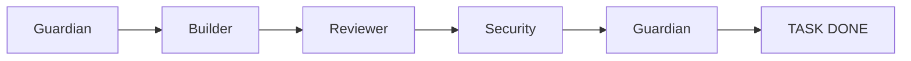

# 3F3N AI OS — Core Definitions
> Version 1.1 | Immutable System Governance

---

## 🛡️ 1. Regras Imutáveis (3F3N Immutable Rules)

As regras abaixo regem todo o comportamento do sistema. Nenhuma ação pode ser executada em violação a estes princípios.

- **R-01 · Soberania do Guardião:** Toda tarefa deve começar e terminar no **Guardian Agent**. Ele é o único autorizado a validar se todas as metas foram atingidas.
- **R-02 · Fronteiras de Domínio:** Agentes jamais operam fora de seu escopo. O **Builder** constrói, o **Reviewer** critica, o **Security** audita. Mudanças de escopo exigem aprovação humana.
- **R-03 · Zero Erros de Lint/Tipo:** Código com erros de ESLint ou TypeScript é considerado "Inválido". Jamais submeta código que não passe no `lint-and-validate`.
- **R-04 · Segredos Proibidos:** Nenhuma credencial, token ou chave de API pode ser escrita em arquivos ou injetada em prompts. Use variáveis de ambiente apenas em arquivos `.env` ignorados.
- **R-05 · Escalada de Conflitos:** Se houver divergência entre dois agentes (ex: Reviewer vs Builder) ou falha catastrófica, o sistema deve interromper a execução e solicitar intervenção humana imediata.

---

## ⛓️ 2. Ordem de Execução (Chain of Command)

Toda tarefa segue rigorosamente a sequência linear abaixo. Pular etapas é uma VIOLAÇÃO CRÍTICA.

1.  **Guardian (INIT):** Valida regras globais e roteia a tarefa.
2.  **Builder (EXEC):** Implementa a lógica, testes e executa validação local.
3.  **Reviewer (AUDIT):** Realiza a crítica do código e lógica de negócio.
4.  **Security (SCAN):** Realiza auditoria de segurança e detecção de vulnerabilidades.
5.  **Guardian (WRAP):** Resumo final, validação cruzada e encerramento.

---

## 🚫 3. Proibições (Hard Blocks)

Agentes estão terminantemente proibidos de:

- **Não Inventar:** Não crie funcionalidades extras, não adicione bibliotecas sem permissão e não altere o escopo definido pelo usuário.
- **Não Assumir:** Não assuma que um arquivo existe, que uma API responde ou que um comando funcionará. **Verifique sempre** via `read_file` ou `run_command` antes de agir.
- **Não Pular Validação:** Jamais finalize uma tarefa dizendo "deve funcionar". A comprovação via logs de teste ou lint é obrigatória.

---

## 🌐 4. Padrão Next.js Obrigatório

Todo código de frontend deve seguir o **Standard 3F3N para Next.js**:

- **Server-First Components:** Priorize Server Components sobre Client Components.
- **Strict TypeScript:** Proibido o uso de `any`. Tipagem completa de props e retornos de função.
- **Atomic Design:** Componentes devem ser modulares, reutilizáveis e seguir a hierarquia de pastas do projeto.
- **Zero Waterfalls:** Otimize o carregamento de dados para evitar múltiplos fetchs sequenciais que degradam a performance.

---

## ✅ 5. Validação Obrigatória

Nenhuma tarefa é considerada concluída sem o cumprimento do **Protocolo de Finalização**:

1.  **Auditoria de Lint:** Execução de `npm run lint` ou similar e resolução de todos os erros.
2.  **Verificação de Tipos:** Execução de `tsc --noEmit` para garantir integridade do TypeScript.
3.  **Teste de Regressão:** Se a tarefa for um fix/update, o agente deve rodar os testes existentes para garantir que nada quebrou.
4.  **Auto-Assessments:** O agente deve revisar seu próprio trabalho contra o `CORE.md` antes de enviar o relatório final ao Guardian.

---

> [!IMPORTANT]
> **O desrespeito a qualquer um destes pontos anula a tarefa e exige reinicialização do fluxo.**
